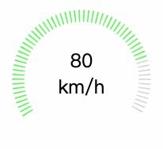

## vue_canvas_mileage - 里程表的实现

#### 效果展示
> canvas.html - 是HTML静态页面版本、vuecanvas是 vue2.0版本


#### HTML版本
- 首先需要了解一些基础知识
    - canvas 使用arc()在canvas中圆画弧
    - context.arc(x, y, radius, startAngle, endAngle [, anticlockwise]) 
        - x 圆弧对应的圆心横坐标
        - y 圆弧对应的圆心纵坐标
        - radius 圆弧的半径大小。
        - startAngle 圆弧开始的角度，单位是弧度。
        - endAngle 圆弧结束的角度，单位是弧度。
        - anticlockwise如果设置为true，则表示按照逆时针方向从startAngle绘制到endAngle。
```
<!DOCTYPE html>
<html>
<head>
    <title>Canvas Mileage demo</title>
</head>
<body>
<div class="mileage">
    <canvas id="myCanvas" width="200" height="200"></canvas>
    <div class="mileageNumber" >
        <div id="mileageNumber"></div>
        <div>km/h</div>
    </div>
</div>
<script type="text/javascript">

/** 
 * 先看一个基础的知识点
 * context.arc(x, y, radius, startAngle, endAngle [, anticlockwise]) 
 * x: 圆弧对应的圆心横坐标。
 * y:Number 圆弧对应的圆心纵坐标。
 * radius:Number 圆弧的半径大小。
 * startAngle:Number 圆弧开始的角度，单位是弧度。
 * endAngle:Number 圆弧结束的角度，单位是弧度。
 * anticlockwise（可选）Boolean 弧度的开始到结束的绘制是按照顺时针来算，还是按时逆时针来算。如何设置为true，则表示按照逆时针方向从startAngle绘制到endAngle。
 * **/

let c=document.getElementById("myCanvas");
let ctx=c.getContext("2d");
let pr = 0
function fw(pro){
    const lineWidth = 15
    const pre  = pro * 0.61 // 百分比转换 使 pro 的值为 1-100
    ctx.clearRect(0,0,200, 200) // 清空画布 
    for(let i=0;i<=90;i++){
        if(i <= 60){
            ctx.beginPath();
            ctx.lineWidth = lineWidth;
            let lab = 1
            let color = i < pre ? "#14e524" : "#cccccc"; 
            ctx.strokeStyle = color;
            let num = i*4 // 两条线中间的间隔 与i 的值有关系  4*90 = 360
            let st = 1.18*Math.PI // 控制起始的位置 0度为三点钟方向 
            ctx.arc(100,100,80,(lab*num)*(Math.PI/180) - st,(lab*(num+1))*(Math.PI/180) - st);
            ctx.stroke();
            ctx.closePath();
        }
    }
}
let timer = setInterval(() => {
    pr < 80 ? pr++ : clearInterval(timer)
    document.getElementById('mileageNumber').innerHTML = pr
    fw(pr)
}, 20);
</script>
<style>
    .mileage{
        position: relative;
        width: 300px;
        height: 300px;
    }
    canvas{
        position: absolute;
        margin: 0 auto;
    }
    .mileageNumber{
        position: absolute;
        text-align: center;
        font-size: 24px;
        width: 200px;
        margin-top: 60px;
    }
</style>
</body>
</html>
```